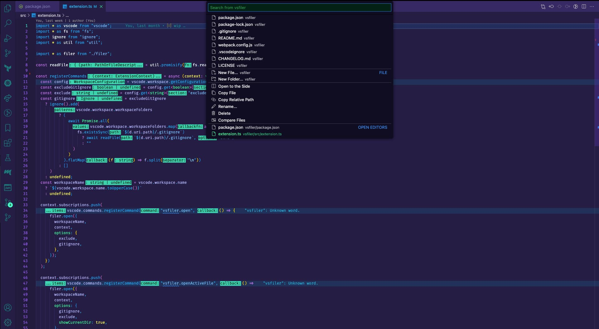

# vsfiler

vsfiler is an File Explorer for VS Code, inspired by vimfiler.

## Features

- Filter file and navigate directories by only keyboard.
- New files and directories, copy, rename and delete by only keyboard.

## Usage

`vsfiler.open` in the Command Pallet.

## Extension Settings

- `vsfiler.excludeGitIgnore`: Controls whether entries in .gitignore should be parsed and excluded from the Quick Filer..
- `vsfiler.exclude`: Configure glob patterns for exluding files.

## Release Notes

### 0.0.1

Initial release
